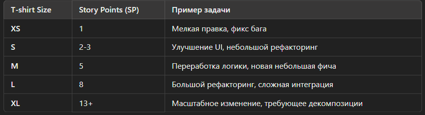

# Release - v2.0 Budget Keeper
### Заметки по проекту Release - v2.0

#### Основная цель проекта: 
Улучшение пользовательского опыта пользованием приложения и оптимизация кода.

#### Задачи: 
* реализовать функционал, обеспечивающий более плавный переход между разделами приложения, без "мерцаний";
* оптимизировать код: уменьшить количество подключений к базе данных, где это возможно

#### Инструменты для оценки задач:

Для оценки трудозатрат для выполнения задач было решено использовать комплекс инструментов - Story Points (SP) + T-shirt Sizes

Таблица для определения трудозатрат: 

